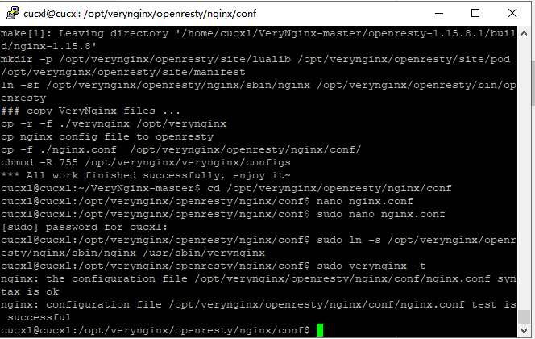
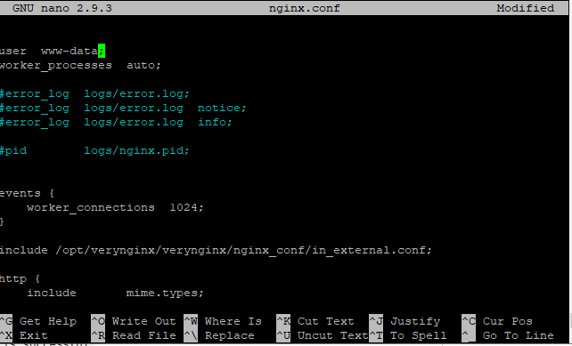
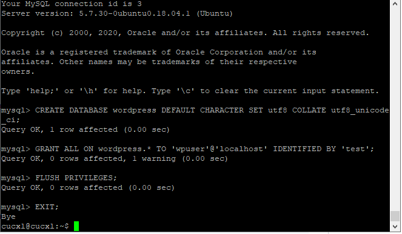
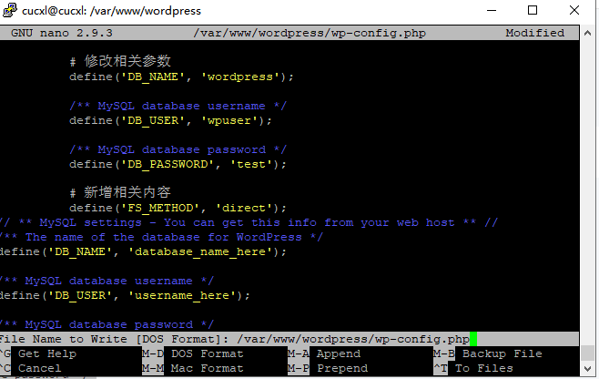
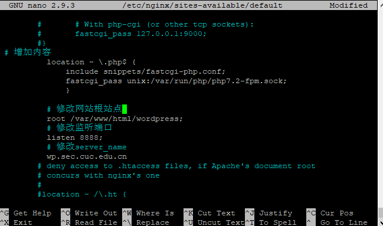
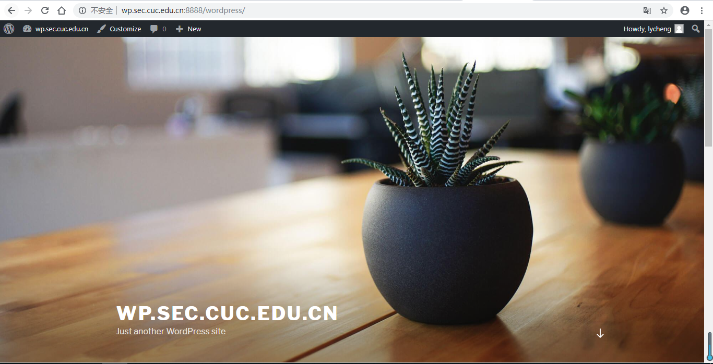
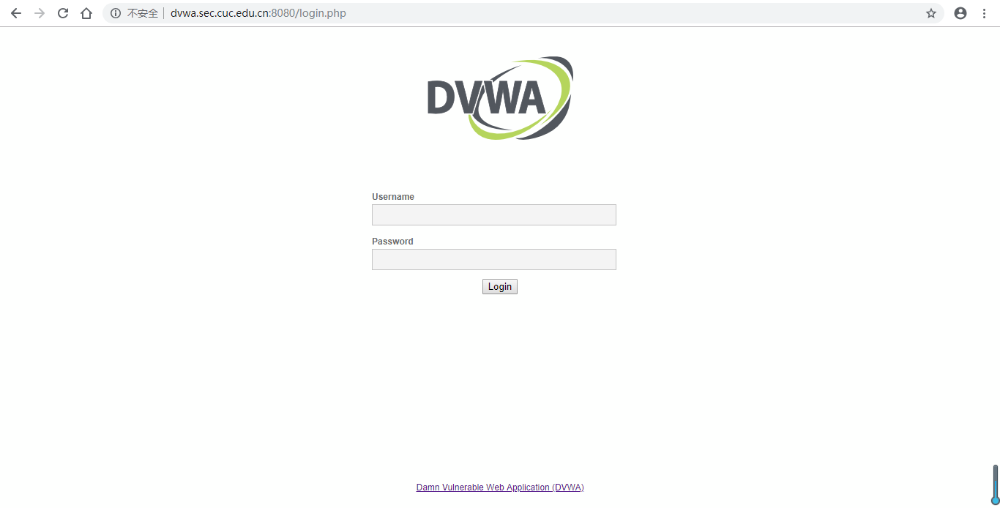
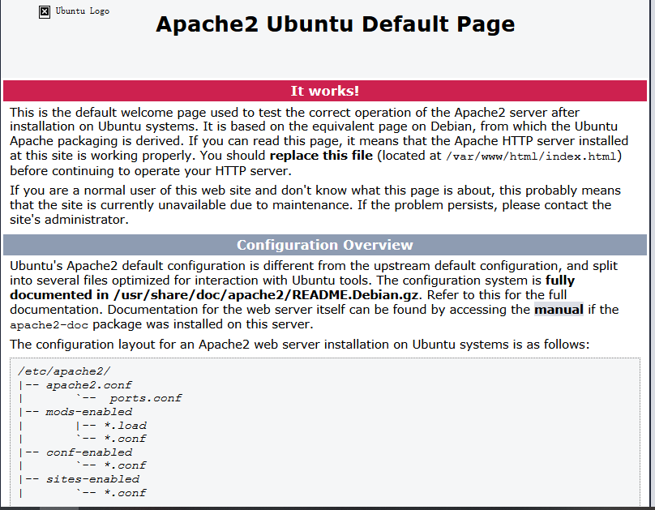

# 第五章：WEB服务器（实验）

## 实验环境

- VirtualBox 

- ubuntu-18.04.2

- nginx version: nginx/1.14.0 (Ubuntu)

- VeryNginx

- wordpress-4.7

-  Damn Vulnerable Web Application (DVWA)

## 环境配置

### 修改Windows主机上的host文件

向 `C:\Windows\System32\drivers\etc\hosts` 中添加三条内容

        192.168.56.103 wp.sec.cuc.edu.cn
        192.168.56.103 dvwa.sec.cuc.edu.cn
        192.168.56.103 verynginx.sec.cuc.edu.cn

### 安装 Nginx

根据官网的[下载指南](http://nginx.org/en/linux_packages.html)下载nginx

    $ sudo apt update
    $ sudo apt install nginx

 

### 安装 VeryNginx

根据官方的 `GitHub` [仓库指南](https://github.com/alexazhou/VeryNginx/blob/master/readme_zh.md)进行安装

- 先克隆仓库到本地，根据指南执行指令

        $ git clone https://github.com/alexazhou/VeryNginx.git
        $ cd VeryNginx
        $ python install.py install

- 安装相关依赖。尝试安装，安装成功

        # 安装依赖
        $ sudo apt-get update
        $ sudo apt-get install python3
        $ sudo apt-get install libssl1.0-dev
        $ sudo apt-get install zlib1g-dev

        # 重新再尝试安装
        $ sudo python3 install.py install

- 修改 `/opt/verynginx/openresty/nginx/conf/nginx.conf` 配置文件,设置 `server` 监听端口为 `8080` ， `user` 修改为 `www-data`

- 开启VeryNginx

        $ sudo /opt/verynginx/openresty/nginx/sbin/nginx

- 现在我们可以去访问 `http://verynginx.sec.cuc.edu.cn:8080/verynginx/index.html` 到 VeryNginx 的界面，用户/密码为 `verynginx/verynginx`

### 安装 wordpress

- 下载mysql、php和相关扩展

        # 安装数据库
        $ sudo apt install mysql-server
        # 检查是否正常运行，默认下无密码
        $ sudo mysql -u root -p

        #安装php和相关扩展
        $ sudo apt install php-fpm php-mysql
        $ sudo apt install php-curl php-gd php-intl php-mbstring php-soap php-xml php-xmlrpc php-zip
        $ sudo systemctl restart php7.2-fpm

- 创建 wordpress 需要数据库支持

        # mysql新建数据库
        $ sudo mysql -u root -p
        > CREATE DATABASE wordpress DEFAULT CHARACTER SET utf8 COLLATE utf8_unicode_ci;
        > GRANT ALL ON wordpress.* TO 'wpuser'@'localhost' IDENTIFIED BY 'test';
        > FLUSH PRIVILEGES;
        > EXIT;

- 下载 wordpress

        $ cd /tmp

        # 下载实验指定版本安装包
        $ sudo wget https://wordpress.org/wordpress-4.7.zip

        # 解压
        $ unzip wordpress-4.7.zip

        # 移动文件夹到指定目录
        $ cp /tmp/wordpress-4.7/wordpress/wp-config-sample.php /tmp/wordpress-4.7/wordpress/wp-config.php
        $ sudo cp -a /tmp/wordpress-4.7/wordpress/. /var/www/wordpress

        # 修改文件夹属主为 www-data
        $ sudo chown -R www-data:www-data /var/www/wordpress

- 修改 wordpress 相关配置文件

        $ curl -s https://api.wordpress.org/secret-key/1.1/salt/
        $ sudo nano /var/www/html/wordpress/wp-config.php

                # 修改内容如下
                # 修改相关参数
                define('DB_NAME', 'wordpress');

                /** MySQL database username */
                define('DB_USER', 'wpuser');

                /** MySQL database password */
                define('DB_PASSWORD', 'test');

                # 新增相关内容
                define('FS_METHOD', 'direct');
        
        $ sudo nano /etc/nginx/sites-available/default

                # 增加内容
                location ~ \.php$ {
                    include snippets/fastcgi-php.conf;
                    fastcgi_pass unix:/var/run/php/php72-fpmsock;
                    }
                
                # 修改网站根站点
                root /var/www/html/wordpress;
                # 修改监听端口
                listen 8888;
                # 修改server_name
                wp.sec.cuc.edu.cn

        
        # 语法检查
        $ sudo nginx -t

        # 重启nginx
        $ sudo systemctl restart nginx

### 安装 dvwa

- 下载安装包

        $ cd /tmp
        $ git clone https://github.com/ethicalhack3r/DVWA
        $ sudo mv /tmp/DVWA /var/www/html

- dvwa需要数据库支持，所以先新建数据库

        $ sudo mysql -u root -p

        > CREATE DATABASE dvwa DEFAULT CHARACTER SET utf8mb4 COLLATE utf8mb4_unicode_ci;
        > GRANT ALL ON dvwa.* TO 'dvwauser'@'localhost' IDENTIFIED BY 'test';
        > FLUSH PRIVILEGES;
        > EXIT;

        $ sudo systemctl restart mysql

- 修改dvwa数据库相关和其他设置

        $ cd /var/www/html/DVWA
        $ cp config/config.inc.php.dist config/config.inc.php
        $ sudo vim /var/www/html/DVWA/config/config.inc.php 
                
                # 修改以下内容
                $_DVWA[ 'db_database' ] = 'dvwa';
                $_DVWA[ 'db_user' ]     = 'dvwauser';
                $_DVWA[ 'db_password' ] = 'test';
        
        # 修改文件属主
        $ sudo chown -R www-data:www-data /var/www/html/DVWA

        # 修改 nginx 相关配置
        $ sudo vim /etc/nginx/sites-available/default

            server {
                    listen 5566;
                    server_name  dvwa.sec.cuc.edu.cn;

                    root /var/www/html/DVWA;
                        index index.html index.htm index.php index.nginx-debian.html;
                        location / {
                                try_files $uri $uri/ = 404;
                                }

                        location ~ \.php$ {
                                include snippets/fastcgi-php.conf;
                                fastcgi_pass unix:/var/run/php/php7.2-fpm.sock;
                                }
                                }

        # 修改php相关设置
        $ sudo vim  /etc/php/7.2/fpm/php.ini

                # 修改以下内容
                allow_url_include = On
                display_errors = off
        
        # 重启php，使配置生效
        $ sudo systemctl restart php7.2-fpm

        $ 重启nginx，使配置生效
        $ sudo systemctl restart nginx

### 设置 VeryNginx 实现端口转发

- 修改Nginx配置文件，将原本wordpressd的 `8888` 端口修改为 `127.0.0.1:8888`，DVWA的 `5566` 端口修改为 `127.0.0.1:5566`

- 通过 `VeryNginx` 进行相关设置

  

  
        
- 为了能以https的方式访问 `wordpress`，在 `VeryNginx` 中设置443端口，并配证书

        # 生成证书
        $ sudo openssl req -x509 -nodes -days 365 -newkey rsa:2048 -keyout /etc/ssl/private/wordpress-selfsigned.key -out /etc/ssl/certs/wordpress-selfsigned.crt

        # 将证书地址写入文件，方便后面使用
        $ sudo vim /etc/nginx/snippets/self-signed.conf
                ssl_certificate /etc/ssl/certs/nginx-selfsigned.crt;
                ssl_certificate_key /etc/ssl/private/nginx-selfsigned.key;

        # 修改 VeryNginx 设置
        $ sudo vim /opt/verynginx/openresty/nginx/conf/nginx.conf

                # 增加以下内容
                server {
                        listen 443 ssl;
                        server_name wp.sec.cuc.edu.cn;
                        root /var/www/html;
                        include /opt/verynginx/verynginx/nginx_conf/in_server_block.conf;
                        include /etc/nginx/snippets/self-sign.conf;

                        location = / {
                                root html;
                                index index.html index.html;
                        }
                }
        
        # 修改 nginx 设置
        $ sudo vim /etc/nginx/sites-available/default

                # 在 wordpress 对应的 server 中增加如下

                include /etc/nginx/snippets/self-sign.conf;
        

## 安全加固

- 使用IP地址方式均无法访问上述任意站点，并向访客展示自定义的友好错误提示信息页面-1

  - 修改 `Matcher`

    

  - 修改 `Response`

    

  - 修改 `Filter`

    

- Damn Vulnerable Web Application (DVWA)只允许白名单上的访客来源IP，其他来源的IP访问均向访客展示自定义的友好错误提示信息页面-2

  - 修改 `Matcher`

    

  - 修改 `Response`

    

  - 修改 `Filter`

    

  - 效果
        
    

- 在不升级Wordpress版本的情况下，通过定制VeryNginx的访问控制策略规则，热修复[WordPress < 4.7.1 - Username Enumeration](https://www.exploit-db.com/exploits/41497)

  - 通过阅读资料，我们可以知道这个漏洞是通过访问了特定的URI（ `wp-json/wp/v2/users/` ）实现的，所以我们需要做的就是禁止去访问它即可

  - 修改 `Matcher`

    

  - 修改 `Response`

    

  - 修改 `Filter`

    

- 通过配置VeryNginx的Filter规则实现对Damn Vulnerable Web Application (DVWA)的SQL注入实验在低安全等级条件下进行防护

  - 防护规则：针对 SQL 注入常用关键词进行防护

  - 修改 `Matcher`

    

  - 修改 `Response`

    

  - 修改 `Filter`

    

## VERYNGINX配置要求

- VeryNginx的Web管理页面仅允许白名单上的访客来源IP，其他来源的IP访问均向访客展示自定义的友好错误提示信息页面-3

  - 修改 `Matcher`

    

  - 修改 `Response`

    

  - 修改 `Filter`

    

- 通过定制VeryNginx的访问控制策略规则实现
  
  - 限制DVWA站点的单IP访问速率为每秒请求数 < 50

  - 限制Wordpress站点的单IP访问速率为每秒请求数 < 20

  - 超过访问频率限制的请求直接返回自定义错误提示信息页面-4

    - 修改 `Response`
      
      
    
    - 修改 `Frequency Limit`

      
    

- 禁止curl访问

  - 修改 `Matcher`

    

  - 修改 `Response`

    

  - 修改 `Filter`

    

## 问题与解决

- 按照课程中提示安装libssl1.0-dev
sudo apt-get install libssl1.0 libssl-dev
报错：The following packages have unmet dependencies:
libssl-dev : Conflicts: libssl1.0-dev but 1.0.2n-1ubuntu5.3 is to be installed
libssl1.0-dev : Conflicts: libssl-dev but 1.1.1-1ubuntu2.1~18.04.5 is to be installed
E: Unable to correct problems, you have held broken packages

根据老师回答：libssl-dev 提供的「候选可用」版本与libssl1.0-dev提供的「候选可用」版本存在「冲突」，不能同时安装两者。

- wp.sec.cuc.edu.cn显示Apache2界面

通过观看视频网站番外篇及网上查阅资料，已经明白事情发生原理及解决办法

## 参考资料
- [linux-2019-Cassie8888](https://github.com/CUCCS/linux-2019-Cassie8888/blob/linux_05/linux05/实验五.md)

- [linux-2019-jackcily](https://github.com/CUCCS/linux-2019-jackcily/blob/job5/job5/实验5.md)

- [nginx: Linux packages](http://nginx.org/en/linux_packages.html)

- [alexazhou/VeryNginx](https://github.com/alexazhou/VeryNginx/blob/master/readme_zh.md)

- [How To Install WordPress with LEMP on Ubuntu 18.04](https://www.digitalocean.com/community/tutorials/how-to-install-wordpress-with-lemp-on-ubuntu-18-04)

- [How to Install and Configure DVWA Lab on Ubuntu 18.04 server](https://kifarunix.com/how-to-setup-damn-vulnerable-web-app-lab-on-ubuntu-18-04-server/)

- [WordPress < 4.7.1 - Username Enumeration](https://www.exploit-db.com/exploits/41497)

