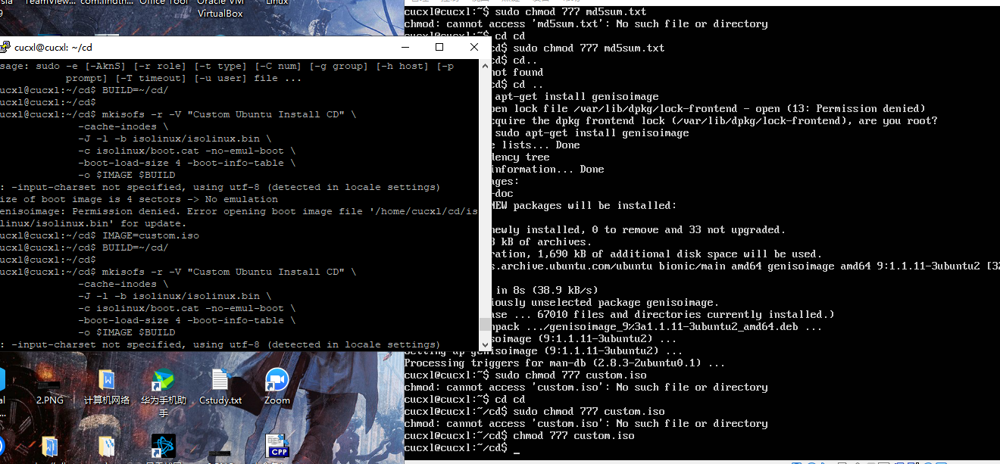

## 无人值守Linux安装镜像制作

### 1 网卡配置(双网卡)

- 将虚拟机配置为双网卡模式（NAT&host-only）


- 打开虚拟机的网卡二并修改配置信息

  

```
sudo vi /etc/netplan/01-netcfg.yaml
```


修改结果可用`ifconfig`查看，结果如下图所示：

  

### 定制安装OpenSSH Server

- 下载PuTTY，填写虚拟机enp0s8的ip地址，自定义名字以后保存


- 安装openssh-server以实现通过PuTTY登入的目的

  

- 通过PuTTY登入linux

  

### 安装镜像

- 在当前用户目录下创建一个用于挂载iso镜像文件的目录：`mkdir loopdir`

- 将在windows下下载好的镜像通过cmd进行远端传输：

  `scp path_ubuntu-18.04.4-server-amd64.iso username@ip:`

  
- 由于loopdir具有操作权限，若直接运行`mount -o loop ubuntu-16.04.1-server-amd64.iso loopdir`会报错，所以可在该语句前添加`sudo`以使用root权限进行操作或者修改loopdir的权限`sudo chmod 777 loopdir`
  
- 创建一个工作目录用于克隆光盘内容：`mkdir cd`

- 同步光盘内容到目标工作目录：`rsync -av loopdir/ cd`

  

- 卸载iso镜像：`umount loopdir` 需加上sudo

- 进入目标工作目录：`cd cd/`
  
- 编辑Ubuntu安装引导界面增加一个新菜单项入口`vim isolinux/txt.cfg`，添加以下内容到该文件以后强制保存退出：

  ```
  label autoinstall
    menu label ^Auto Install Ubuntu Server
    kernel /install/vmlinuz
    append  file=/cdrom/preseed/ubuntu-server-autoinstall.seed debian-installer/locale=en_US console-setup/layoutcode=us keyboard-configuration/layoutcode=us console-setup/ask_detect=false localechooser/translation/warn-light=true localechooser/translation/warn-severe=true initrd=/install/initrd.gz root=/dev/ram rw quiet
  ```

- 阅读Ubuntu官方提供的示例[preseed.cfg](https://help.ubuntu.com/lts/installation-guide/example-preseed.txt)，根据个人需求定制装机选项，并通过cmd传输至虚拟机：

  `scp ubuntu-server-autoinstall.seed username@ip:cd/preseed`
  

- 修改isolinux.cfg：`vim isolinux/isolinux.cfg`  -->  add `timeout 10`

- 修改md5sum.txt的权限并重新生成md5sum.txt：

  `sudo chmod 777 md5sum.txt`

  `cd ~/cd && find . -type f -print0 | xargs -0 md5sum > md5sum.txt`

- 封闭改动后的目录到.iso：

  ```
  IMAGE=custom.iso
  BUILD=~/cd/
  
  mkisofs -r -V "Custom Ubuntu Install CD" \
              -cache-inodes \
              -J -l -b isolinux/isolinux.bin \
              -c isolinux/boot.cat -no-emul-boot \
              -boot-load-size 4 -boot-info-table \
              -o $IMAGE $BUILD
  ```


  注意：此处需要修改custom.iso的权限，并安装genisoimage
  
  
- 镜像文件传输运行安装：
  
  

  ```
  用PSFTP将封装好的ISO文件传输出来，再进行安装。安装中比较不同。
  安装时正常挂载到光盘上安装。

  
